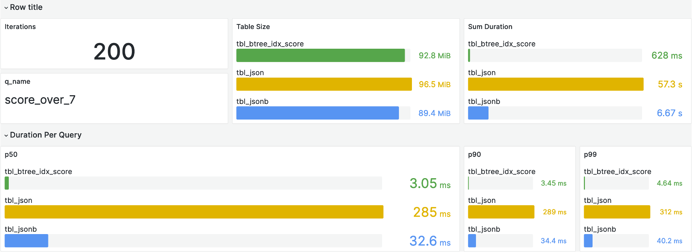

# pg_json_bench

The goal of this project is to help to compare how different data types and indexes behaves with inserts and queries with json data.

After running the tests, pg_json_bench publishes the result to prometheus gateway and it is possible see the result on the prepared grafana dashboards.

**Example of a dashboard generated by pg_json_bench**


## Presentations
- Postgres Ibiza 2023: [Leveraging the Power of JSON JSONB Fields](./presentations/Leveraging%20the%20Power%20of%20JSON%20JSONB%20Fields.pdf)
- PGConf.EU 2023: [Lightning - TEXT is faster than JSON](./presentations/Lightning%20-%20TEXT%20is%20faster%20than%20JSON.pdf)

## Running
**Spin up docker compose with monitoring stack**
```shell
docker compose up -d
```

**Prepare the data**
```shell
mkdir ./data
wget https://raw.githubusercontent.com/algolia/datasets/master/movies/records.json -O ./data/records.json
```

**Prepare the schema**
```shell
psql -c "create database test;"
psql -d test < ./main.sql
```

**Build**
```shell
go build -o pg_json_bench
```

**Run Benchmark**
Example:
```shell
DBCONN="dbname=test sslmode=disable" ./pg_json_bench query count_score_over_7 btree_idx_score,gin_idx,gin_idx_path
```

On the output the link for the metrics will be displayed, maybe you need to refresh.
Grafana user and password is `admin`

## Available commands

### insert
Example:
```
./pg_json_bench insert <comma separated list of tables to test>
```

### query
Example:
```
./pg_json_bench query <query> <comma separated list of tables to test>
```

Available query options:
- select_all
- score_over_7
- count_score_over_7
- count_year_2000_at_gt
- count_year_2000_eq

## Tables
Available options:
- text
- json
- jsonb
- btree_idx_score
- gin_idx
- gin_idx_path

Note that the actual table name is prefixed with `tbl_`, so when `text` is passed as a parameter the table `tbl_text` will be used.
